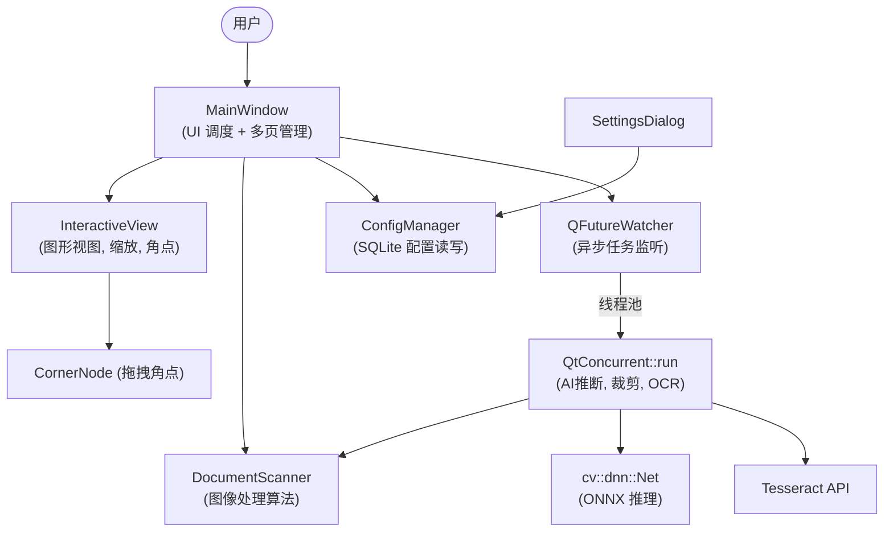

# 📄 DocScanner — AI 智能文档扫描与 OCR 识别系统

> 拍照即得扫描件，AI 精准提取文字，多页一键 PDF —— 让纸质文档数字化从未如此简单。

[](LICENSE)
[](https://github.com/yourname/DocScanner/actions)
[](https://github.com/yourname/DocScanner/releases)


---

## 📖 项目概述

**DocScanner** 是一款 **全平台桌面端 AI 文档扫描与后处理工具**，专为需要将纸质文档、书籍、笔记快速电子化的个人用户、办公人员及学生群体设计。  
解决传统扫描仪笨重、拍照文件变形、背景杂乱、文字无法复制检索的痛点。  
项目集成了 **U²‑Net 深度学习模型** 进行精准边缘检测，结合 **经典计算机视觉算法** 实现透视矫正、自动裁剪、多种滤镜增强（黑白、灰度、Magic Color）、3D 曲面展平，并内置 **Tesseract OCR 引擎** 直接提取图片中的文字。  
支持 **批量处理、多页管理、缩略图拖动排序、一键导出 PDF 或图片**，提供现代化的暗色主题界面，流畅的缩放/拖拽交互，极大提升办公效率。

**适用场景**：合同扫描、身份证件归档、读书笔记摘录、板书拍摄、试卷整理等。  
**目标用户**：教育工作者、行政文员、创业者、以及任何经常处理纸质文档的人员。

---

## ✨ 核心功能特性

- **🤖 双模智能边缘检测**  
  - **AI 模式**：自研集成 U²‑Net 轻量网络，自动识别文档/书籍四角，抗干扰能力强（即使背景杂乱也能精准定位）。  
  - **传统模式**：基于 Canny 边缘检测 + 多边形逼近，无需额外模型文件，响应迅速，适合简单场景。  
  支持手动拖拽角点进行微调，并实时显示四边形轮廓。

- **🖼️ 四种扫描增强滤镜**  
  - 原图矫正（仅透视变换，保留原始色彩）  
  - **Magic Color**：自动色彩均衡 + 适度饱和度提升，文档色彩更鲜明。  
  - 省墨模式（灰度输出，打印节约耗材）  
  - **黑白文档**：基于自适应阈值二值化，消除光照不均，极致清晰，最适合 OCR。  
  所有滤镜效果实时预览，切换即刷新。

- **📄 3D 弯曲书页校正**  
  提供滑块控制“曲面展平强度”，可模拟物理扫描仪的展平效果，有效修复由于书脊造成的文字变形。

- **🔤 一键 OCR 文本提取**  
  集成 Tesseract 5.x，支持**中英文混合识别**。识别结果可一键复制到剪贴板，方便二次编辑。

- **📑 多页批量处理与 PDF 导出**  
  支持同时导入多张图片，每页独立保存状态（原始图、裁剪坐标、滤镜参数）。可通过缩略图选中多页，批量执行 AI 检测、裁剪和滤镜渲染。  
  支持**缩略图拖拽排序**，按当前顺序导出为**多页 PDF**，完美复刻扫描仪体验。

- **⚙️ 智能配置中心**  
  SQLite 持久化保存用户偏好：AI 模型路径、Tesseract 语言包目录、默认滤镜模式、默认曲面校正值。重启软件自动恢复。

- **🎨 现代暗色交互界面**  
  基于 Qt 6 深度定制，支持 Ctrl+滚轮无极缩放、鼠标拖拽平移视图，全部控件采用低饱和度科技风格，操作流畅且不刺眼。

---

## 🔧 技术栈与环境依赖

### 核心技术栈

| 类别        | 名称               | 版本要求                      | 说明                     |
|-----------|---------------------|-----------------------------|--------------------------|
| 编程语言   | C++                  | C++17 或更高                 |                          |
| 框架       | Qt                   | 6.5.x                        | Core, Widgets, Concurrent, Sql |
| 计算机视觉 | OpenCV               | 4.5+ (含 dnn 模块)           | 图像处理、DNN 推理        |
| OCR 引擎   | Tesseract            | 5.x                          | 文字识别                 |
| 图像库     | Leptonica            | 1.80+                        | Tesseract 依赖           |
| AI 模型    | U²‑Net (u2netp.onnx) | -                           | 文档边缘检测 ONNX 模型    |
| 数据库     | SQLite               | Qt 内建                      | 配置持久化               |
| 构建系统   | CMake                | 3.19+                        | 跨平台编译                |

### 环境要求

- **操作系统**：Windows 10/11, macOS 11+, Ubuntu 20.04+ 或其它 Linux 发行版  
- **硬件最低配置**：  
  - CPU：任意双核处理器  
  - 内存：4 GB  
  - 硬盘：200 MB 空余（不含模型和语言包）  
- **编译环境**：  
  - Windows：推荐 MSYS2 MinGW64 或 Visual Studio 2022，需预先安装 Qt6 和 OpenCV-MinGW 预编译库  
  - Linux：GCC 9+，通过包管理器安装依赖  
  - macOS：Clang 13+，通过 Homebrew 安装 Qt 和 OpenCV  

---

## 🚀 快速开始 / 安装部署

### 1. 下载项目源码

```bash
git clone https://github.com/yourname/DocScanner.git
cd DocScanner
```

### 2. 安装依赖库

根据操作系统选择对应的步骤。

<details>
<summary>Windows (MSYS2 MinGW64) </summary>

前提：已安装 [MSYS2](https://www.msys2.org/) 并更新，打开 **MSYS2 MinGW x64** 终端。

```bash
# 安装编译工具链
pacman -S mingw-w64-x86_64-cmake mingw-w64-x86_64-gcc mingw-w64-x86_64-ninja

# 安装 Qt6
pacman -S mingw-w64-x86_64-qt6-base

# 安装 OpenCV（功能完整，含 dnn）
pacman -S mingw-w64-x86_64-opencv

# 安装 Tesseract 和 Leptonica（用于 OCR）
pacman -S mingw-w64-x86_64-tesseract-ocr mingw-w64-x86_64-leptonica
# 下载中文语言包（如需），放在 tessdata 目录下
# 可从 https://github.com/tesseract-ocr/tessdata 下载 chi_sim.traineddata
```

</details>

<details>
<summary>Linux (Ubuntu 22.04) </summary>

```bash
# 安装基础编译工具
sudo apt update
sudo apt install build-essential cmake ninja-build

# 安装 Qt6
sudo apt install qt6-base-dev libqt6sql6-sqlite

# 安装 OpenCV（确保包含 dnn 模块）
sudo apt install libopencv-dev

# 安装 Tesseract 和 Leptonica
sudo apt install tesseract-ocr libtesseract-dev libleptonica-dev
sudo apt install tesseract-ocr-chi-sim  # 中文语言包
```

</details>

<details>
<summary>macOS (Homebrew) </summary>

```bash
brew update
brew install cmake ninja qt@6 opencv tesseract leptonica
brew link qt@6 --force
export CMAKE_PREFIX_PATH=$(brew --prefix qt@6)
```

</details>

### 3. 下载 AI 模型文件

项目依赖 U²‑Net ONNX 模型进行 AI 边缘检测。将 `u2netp.onnx` 放置到项目根目录下的 `model/` 文件夹内。

```bash
mkdir model
# 从原 U²‑Net 发布页或本项目的 Release 页下载，例如：
wget -P model/ https://github.com/ZHKKKe/U2net-portrait-matting/releases/download/v1.0/u2netp.onnx
```

### 4. 准备 OCR 语言包（可选）

Tesseract 默认语言包路径可配置。为使用中文识别，需确保 `tessdata/` 目录下存在 `chi_sim.traineddata`。  
可以从 [tesseract-ocr/tessdata](https://github.com/tesseract-ocr/tessdata) 下载，或直接安装系统包（Linux 下安装 `tesseract-ocr-chi-sim`）。

### 5. 编译项目

```bash
mkdir build && cd build
cmake .. -G Ninja -DCMAKE_BUILD_TYPE=Release
ninja
```

编译成功后，可执行文件 `doc` (Windows 下为 `doc.exe`) 出现在 build 目录。

### 6. 快速验证 Demo

在 build 目录下直接运行程序，测试基本功能：

```bash
# 确保 AI 模型在指定路径（默认 ./model/u2netp.onnx）
./doc

# 如果模型未下载，首次启动会提示警告但仍可正常使用传统边缘检测。
```

导入一张含有文档的图片，点击“AI 检测”按钮，若能自动定位四个角点，则环境配置全部正确。

---

## 📂 项目目录结构

```
DocScanner/
├── CMakeLists.txt              # CMake 构建配置
├── README.md                   # 本文件
├── LICENSE                     # MIT 许可证
├── model/                      # AI 模型存放目录
│   └── u2netp.onnx              # U²-Net 轻量模型文件（需用户自行下载）
├── main.cpp                    # 程序入口
├── mainwindow.h / .cpp / .ui   # 主窗口 UI 与业务逻辑
├── documentscanner.h / .cpp    # 文档扫描核心算法（OpenCV 实现）
├── interactiveview.h / .cpp    # 可缩放交互视图（QGraphicsView）
├── configmanager.h / .cpp      # 配置管理器（单例，SQLite 存储）
├── settingsdialog.h / .cpp / .ui  # 设置对话框界面
└── tessdata/                   # [可选] OCR 语言包目录，可配置
```

**关键文件说明**：

- `mainwindow.*`：应用程序中枢，包含所有控件的信号/槽连接、多页数据管理（`QHash<QString, PageData>`）、异步任务调度。
- `documentscanner.*`：纯 C++/OpenCV 算法库，提供边缘检测、透视矫正、滤镜增强、曲面校正的静态函数。
- `interactiveview.*`：封装了缩放、平移、角点拖拽逻辑的图形视图，同时定义了 `CornerNode` 控件类。
- `configmanager.*`：基于 SQLite 的持久化配置读写，存储模型路径、Tesseract 路径、默认参数等。
- `settingsdialog.*`：提供图形化配置界面，修改后同步更新到 `ConfigManager` 并通知主窗口。

---

## 📘 使用说明

### 操作流程

1. **导入图片**  
   点击左侧“批量导入图片”按钮，支持多选（Ctrl/A 都可以）。导入后可见缩略图列表，图标状态下显示“待处理”。

2. **边缘检测**  
   - **AI 检测**：选中一个或多个缩略图，点击“对选中项执行 AI 检测”。程序将在后台线程运行 U²‑Net，自动计算四角坐标。  
   - **传统检测**：仅对当前页执行快速边缘检测（不依赖 AI 模型）。  
   无论哪种方式，四角会以蓝色圆点标注在左侧原始视图上，同时显示绿色四边形轮廓。

3. **手动微调角点**  
   直接用鼠标拖拽角点，绿色轮廓实时更新。支持 Ctrl+滚轮缩放视图，拖动背景平移视图，方便精确定位。

4. **裁剪与滤镜**  
   - 点击“裁剪并应用滤镜”按钮，程序将对选中的页面进行透视矫正、曲面展平（根据右栏滑条）、并应用当前滤镜模式。  
   - 右侧结果预览会立即显示处理后的图片。左侧缩略图也会更新为处理后的缩略图，并标记“✅ 已裁剪”。  
   - 可通过下拉框切换滤镜（原图/增强显色/省墨/黑白），拖动滑条调整曲面展平强度，结果预览实时刷新。

5. **OCR 文本提取**  
   在当前页为处理完毕状态时，点击“📝 OCR 提取当前页文字”。后台自动调用 Tesseract，识别结束后弹出窗口显示文本，支持一键复制全文。

6. **多页管理**  
   - 缩略图列表支持多选（Ctrl/Shift）、拖拽排序。  
   - 可通过“旋转”按钮调整图片方向（顺/逆时针 90°）。  
   - 点击“将选中/全部合并为 PDF”，按当前缩略图顺序导出为一份 A4 尺寸的多页 PDF 文件。

7. **配置中心**  
   点击左侧顶部的“⚙️ 系统配置中心”可以修改：
   - AI 模型文件路径
   - OCR 语言包目录（tessdata）
   - 默认滤镜模式
   - 默认曲面校正强度  
   设置立即生效。

### 核心 API 一览（供二次开发）

若需在代码中直接使用文档扫描算法，可调用 `DocumentScanner` 类的公共方法：

```cpp
// 头文件: documentscanner.h
class DocumentScanner {
public:
    enum ScanMode { ORIGINAL = 0, MAGIC_COLOR, GRAYSCALE, B_W };
    
    // 传统视觉方法寻找角点
    std::vector<cv::Point2f> findCornersTraditional(const cv::Mat& image);
    
    // AI 方法寻找角点，需提供已加载的 ONNX 网络
    std::vector<cv::Point2f> findCornersAI(const cv::Mat& image, cv::dnn::Net& net);
    
    // 根据四个角点执行透视变换，返回校正后的图像
    cv::Mat warpDocument(const cv::Mat& image, const std::vector<cv::Point2f>& pts);
    
    // 增强滤镜处理，mode 指定模式
    cv::Mat enhanceDocument(const cv::Mat& warped, ScanMode mode);
    
    // 3D 曲面展平，curve_amount 范围 -100~100，0 为不处理
    cv::Mat dewarpDocument(const cv::Mat& src, float curve_amount);
};
```

### 典型使用案例

#### 案例 1：快速扫描身份证/名片

```cpp
// 假设已加载图像到 img，且通过手动或 AI 获得了 corners
DocumentScanner scanner;
cv::Mat warped = scanner.warpDocument(img, corners);
cv::Mat result = scanner.enhanceDocument(warped, DocumentScanner::B_W);
// result 即为黑白清晰扫描件，可直接用于电子存档或打印
```

#### 案例 2：批量处理多页 PDF 并使用自定义滤镜

```cpp
// 遍历页面，分别处理
for (auto& page : pages) {
    auto corners = scanner.findCornersAI(page.image, aiNet);
    page.warped = scanner.warpDocument(page.image, corners);
    cv::Mat dewarped = scanner.dewarpDocument(page.warped, 30.0f); // 中度展平
    page.result = scanner.enhanceDocument(dewarped, DocumentScanner::MAGIC_COLOR);
}
// 使用 QPdfWriter 将 results 导出为 PDF...
```

#### 案例 3：在程序中直接调用 OCR

```cpp
tesseract::TessBaseAPI api;
api.Init(nullptr, "chi_sim+eng");
api.SetImage(processedImage.data, ...);
QString text = QString::fromUtf8(api.GetUTF8Text());
api.End();
```

---

## 🧠 架构与核心原理

### 系统架构图（Mermaid）



**核心原理简述**：

- **AI 边缘检测**：将输入图像预处理为 320x320 的 blob，送入 U²‑Net 全卷积网络，输出文档前景掩码，再通过轮廓查找和多边形逼近获得四个角点。该模型通用性强，无需针对特定文档训练。
- **透视矫正**：使用 `getPerspectiveTransform` 将角点包围的四边形区域拉正为矩形，自动计算目标宽高。
- **曲面展平**：采用正弦函数映射模拟书页弯曲，通过 `remap` 完成像素采样，实现页面平坦化。
- **滤镜增强**：Magic Color 🪄 在 Lab 颜色空间应用 CLAHE 对比度受限自适应直方图均衡化，再针对 HSV 饱和度微调；黑白模式使用 `divide` 去除光照不均后调用 `adaptiveThreshold` 获得清晰二值图。
- **异步架构**：所有耗时任务（AI 推理、批量裁剪、OCR）均放入 `QtConcurrent::run` 启动的工作线程，通过 `QFutureWatcher` 将结果回调至主线程，保证界面永不冻结。

---

## 📝 更新日志

### [v1.0.0] - 2024-01-15 (初版发布)
- 实现 AI 边缘检测 (U²‑Net) 与传统 Canny 检测
- 支持四种滤镜模式及实时预览
- 多页批量导入、裁剪、排序、PDF 导出
- 集成 Tesseract OCR，支持中英文混合识别
- 可拖拽角点的手动微调交互
- 曲面校正功能
- SQLite 配置持久化
- 深色主题，自适应缩放拖拽 UI

> 后续版本迭代将在此记录。

---

## ❓ 常见问题 FAQ

<details>
<summary><b>Q: 启动后提示“AI 模型加载失败”，怎么办？</b></summary>

**A**：请确保已按照快速开始步骤下载 `u2netp.onnx`，并确认文件路径正确。  
默认路径为可执行文件所在目录下的 `model/u2netp.onnx`（Windows）或 `../model/u2netp.onnx`（开发模式）。可在“系统配置中心”手动指定模型文件位置。
</details>

<details>
<summary><b>Q: 运行后无法显示中文，或 OCR 输出乱码？</b></summary>

**A**：需确保 `tessdata` 目录下有 `chi_sim.traineddata` 文件，并在配置中正确设置了语言包路径。重启程序后生效。  
若仍乱码，请在 OCR 前确认图片已处理为黑白且文字清晰。
</details>

<details>
<summary><b>Q: Windows 下编译提示找不到 OpenCV 或 Qt6 的头文件。</b></summary>

**A**：请检查 CMake 中的 `OpenCV_DIR` 和 `CMAKE_PREFIX_PATH` 是否指向正确的安装目录。  
MSYS2 环境一般会自动设置，Visual Studio 用户需手动指定。可参考环境变量配置。
</details>

<details>
<summary><b>Q: 传统边缘检测效果不理想，能调参吗？</b></summary>

**A**：目前参数内置，但可修改 `DocumentScanner::findCornersTraditional` 中的 Canny 阈值、双边滤波参数等。后续版本可能开放参数调节。
</details>

<details>
<summary><b>Q: 如何处理多页扫描时顺序混乱？</b></summary>

**A**：在缩略图列表中直接用鼠标拖动调整顺序，导出的 PDF 将严格按当前列表顺序排列。
</details>

<details>
<summary><b>Q: 程序支持摄像头实时扫描吗？</b></summary>

**A**：当前版本仅支持图片文件导入，摄像头功能未实现。欢迎提交 PR 增加此特性。
</details>

<details>
<summary><b>Q: Linux 下显示界面字体过小或错位。</b></summary>

**A**：请确保系统已安装对应中文字体，或调整 Qt 的整体缩放设置：`QT_SCALE_FACTOR=1.5 ./doc`
</details>

---

## 🤝 贡献指南

欢迎任何形式的贡献！请遵循以下规范：

1. **Issue 提交**  
   - 描述清晰的操作步骤、实际结果与预期结果。  
   - 提供系统环境（OS、编译环境）和软件版本。

2. **Pull Request 流程**  
   - Fork 本仓库，创建新分支，建议命名：`feature/xxx` 或 `fix/xxx`。  
   - 保持代码风格与原项目一致（C++17、Qt 信号槽命名规则等）。  
   - 提交前运行编译，确保无 warning，并通过基础功能测试。  
   - PR 描述中说明改动原因、内容及测试情况。

3. **提交信息格式**  
   采用[约定式提交](https://www.conventionalcommits.org/zh-hans/)，例如：  
   ```
   feat: 增加摄像头实时扫描功能
   fix: 修复 PDF 导出时页面方向错误
   docs: 更新 README 安装步骤
   ```

---

## 📜 许可证

本项目基于 **MIT 许可证** 开源，详情见 [LICENSE](LICENSE) 文件。  
简单概括：可以自由使用、复制、修改、合并、发布，但需保留原始版权声明。

---


**🎉 享受无纸化办公的便捷吧！**  
若觉得项目有用，别忘了给一个 ⭐ Star 支持我们！