1.1 核心模块与职责
入口 (main.cpp)：创建 QApplication 与 MainWindow，启动事件循环。

主窗口 (mainwindow.h/cpp)：

界面管理：持有所有控件、缩略图列表、两个 InteractiveView（原始视图与结果预览）。

多页文档管理：使用 QHash<QString, PageData> 存储每页的状态（原图、角点、裁剪结果、滤镜结果等），支持多选、切换、旋转、排序。

业务流程调度：连接按钮点击、滑块变化等信号，启动后台任务（扫描、裁剪、OCR），通过 QFutureWatcher 监听后台线程并更新界面。

外部依赖调用：封装对 DocumentScanner（图像处理）、tesseract（OCR）、ConfigManager（配置）的调用。

文档扫描算法 (documentscanner.h/cpp)：

纯 OpenCV 图像处理，无 Qt 依赖。

提供两种角点检测：传统视觉算法（边缘检测+多边形逼近）和 AI 模型（U²-Net ONNX 推理）。

提供透视矫正、多种滤镜增强、曲面展平功能。

定义 ScanMode 枚举。

交互视图 (interactiveview.h/cpp)：

自定义 QGraphicsView，实现图像的缩放（Ctrl+滚轮）和拖拽平移。

管理可拖拽的 CornerNode（角点控制点），实时绘制多边形轮廓，并将坐标变化反馈给 MainWindow。

角点控件 (CornerNode，在 interactiveview.h/cpp 中定义)：

继承 QGraphicsEllipseItem，可移动，大小恒定为像素值，不随视图缩放变化。

移动时通过 itemChange 通知 InteractiveView::updatePolygon。

配置管理 (configmanager.h/cpp)：

单例模式，基于 SQLite 的键值对存储。

持久化 AI 模型路径、Tesseract 数据路径、默认滤镜、默认曲面强度等。

设置对话框 (settingsdialog.h/cpp)：

供用户修改配置项，调用 ConfigManager 写入，完成后通知 MainWindow 重新加载模型和默认参数。

1.2 关键数据结构
PageData：结构体，包含 id, originalImage, corners, warpedImage, resultImage, filterIndex, dewarpAmount, isProcessed。

documentManager：QHash<QString, PageData>，以 UUID 为键管理所有页面。

1.3 核心调用链与信号槽
AI 扫描流程：
按钮点击 → on_btnScanAI_clicked → QtConcurrent::run（多线程） → 对每个选中页调用 scanner.findCornersAI → 线程结束 → watcher::finished 信号 → on_scanFinished 槽 → 刷新当前页角点。

裁剪流程：
on_btnCrop_clicked → QtConcurrent::run → 对每个选中页调用 scanner.warpDocument、dewarpDocument、enhanceDocument → 线程结束 → cropWatcher::finished → on_cropFinished → 刷新缩略图和预览。

预览实时更新：
comboFilter::currentIndexChanged 或 sliderDewarp::valueChanged → updateResultDisplay → 使用已缓存的 warpedImage 重新计算滤镜/曲面 → 显示在 resultView。

OCR 流程：
on_btnOCR_clicked → QtConcurrent::run → tesseract::TessBaseAPI 识别 → 返回字符串 → ocrWatcher::finished → on_ocrFinished → 弹窗显示结果。

